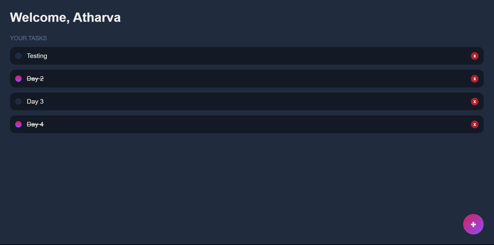

A MERN stack project backed with MongoDb.
Backend repo can be found here: <a href="https://github.com/Atharva-3000/mern_todo_backend">Backend</a>.
 
The deployed website can be found: <a href="https://thunderous-praline-ac5ff4.netlify.app/">HERE</a>
 
<h2>Here's the preview of the website:</h2>
 

